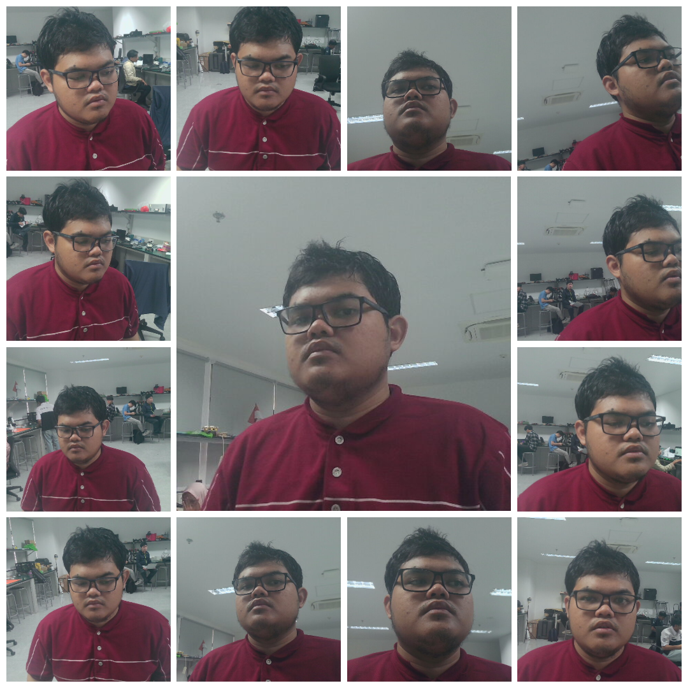
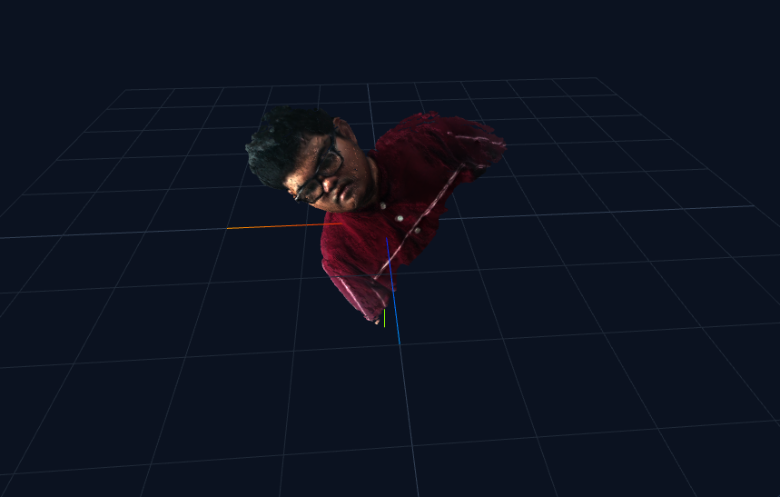

# NodeODM based 3D Photogrametry
- [Requirements](#requirements)
- [Quickstart](#quickstart)
- [Functionality](#functionality)
- [Example Results](#example-results)
- [Advance Usage](#advance-usage-cli)
- [ODM Options](#odm-options)

## Requirements
To use this project, you only need to have **Docker** installed

## Quickstart
1. Run nodeodm docker container
   ```bash
   docker run -it -d -p 3000:3000 --name nodeodm opendronemap/nodeodm --network host
   ```
2. Run application docker container \
   <mark>**[IMPORTANT]**</mark> set NODE_HOST to ip address of the computer running NodeODM
   ```bash
   docker run -d \
   -e NODE_HOST=192.168.200.38 \
   -e NODE_PORT=6969 \
   --name robot-perception \
   --device /dev/v4l/by-id/usb-FEC_NYK_NEMESIS_202001010001-video-index0:/dev/video0 \
   --network host \
   -v "$(pwd)/datasets:/app/datasets" \
   -v "$(pwd)/output:/app/output" \
   --group-add video \
   ghcr.io/anisamsrh/persepsi-robot:latest
   ```
3. Quick Troubleshooting : \
   If you are using Linux/Ubuntu and running docker need sudo access, please refere to any tutorial to register your curret user as part of docker usergroup

## Functionality
1. Convert dataset into 3D model object representation
   > **FUNCTION** : START_ODM \
   **INPUT** : Files of dataset or 1 .zip file \
   **OUTPUT** : .obj file ready to be viewed on the web
2. Run full pipeline
   > **FUNCTION** : RUN_ALL \
   **INPUT** : None \
   **OUTPUT** : .obj file ready to be viewed

3. Take dataset using UR Robotic Arm
   > **FUNCTION** : START_ROBOT \
   **INPUT** : None \
   **OUTPUT** : img files

   <mark>Please SAVE THE IMGS TO ANOTHER DIRECTORY. As of now, we haven't implemented auto download to local</mark>

## Example Results
The datasets were taken by UR Robotic Arm and saved beforehand.



Using, START_ODM, we convert the dataset into .obj below:



## Advance Usage (CLI)
1. Make Robot UR take pictures
   ```bash
   python3 ur.py
   ```

2. Do ODM on specific folder of dataset
   ```bash
   ./run_odm.sh datasets/
   ```

3. Build the docker image yourself
   ```bash
   docker-compose up -d --build
   ```
   or run it
   ```bash
   docker-compose up -d
   ```

## ODM Options
To experiment with combinations of ODM options, you can edit file **run_odm.sh**
| Option Name | Alternative / Supported Values | Description |
| :--- | :--- | :--- |
| **`feature-quality`** | `"ultra"`, `"highest"`, `"high"`, `"medium"`, `"low"`, `"lowest"` | Image feature detection quality level. |
| **`min-num-features`** | Positive integer (Default: `10000`, e.g., `4000`, `8000`, `16000`) | Minimum number of keypoints to extract per image. |
| **`matcher-type`** | `"flann"`, `"bruteforce"`, `"bow"` | The algorithm used for matching features between images. |
| **`mesh-octree-depth`** | Integer from `1` to `14` (Default: `9`) | Density and detail level of the 3D mesh structure. |
| **`mesh-size`** | Positive integer (e.g., `100000`, `200000`, `400000`) | Maximum vertex/polygon count limit for the mesh. |
| **`use-3dmesh`** | `true`, `false` | Enables or disables the generation of a 3D mesh model. |
| **`pc-quality`** | `"ultra"`, `"high"`, `"medium"`, `"low"`, `"lowest"` | Point cloud density and generation quality. |
| **`ignore-gsd`** | `true`, `false` | Bypasses the default GSD limit to process photos at full resolution. |
| **`bg-removal`** | `true`, `false` | Automatically detects and removes sky/horizon backgrounds. |
